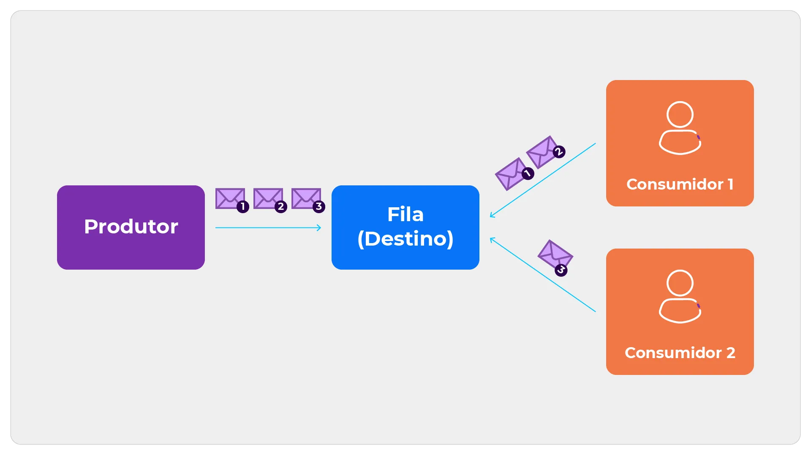

# Mensageria 

E a ideia de que dois sistemas diferentes se comunicam com trocas de mensagens, funcionando de forma assíncrona (não é simultâneo). Adiciona um evento no “Message Broker” dizendo o que quer enviar colocando informações, e o destinatário vai receber e processar conforme o necessário. Podendo continuar o processamento sem precisar se preocupar com o que aconteceu com a mensagem enviada ao outro software. Um exemplo de sistema que possa ser citado é o Google cloud Pub/Sub. 

## Tipos

* __Pub/sub__ 

Tem dois papéis __“Publisher”__ ele publica o evento (mensagem) e o __“Subscriber”__ o que vai receber/consumir o evento (mensagem) e o __“Message Broker”__ faz a ligação entre eles. O __“Publisher”__ oferece o conteúdo e manda através do __“Massage Broker”__ e ele envia ao __“Subscriber”__ e enquanto o __“Publisher”__ não sabe se foi enviado corretamente ao __“Subscriber”__, ele poderá continuar a fazer as coisas sem se preocupar, pois foi feita de forma assíncrona.

* __Fila de mensagens__ 
As mensagens são guardadas em filas, sendo processadas uma única vez ou excluídas. São utilizadas para que diferentes sistemas se comuniquem entre si e dissolver processos pesados. 

* __Mensagem ponto a ponto__ 
Mensagem diretas, sem terem intervenções. 

## Beneficios e dasafios 

A mensageria possui vários benefícios sendo um deles armazenar as mensagens e se caso houver erros são reprocessados, permitindo também que se caso haja necessidade de adicionar algo ou remover é possível sem atingir o funcionamento. Tem uma gama variação de fase de sistemas e aplicações e tem desempenho bom na parte da comunicação assíncrona e na distribuição do conteúdo. Apesar disso tudo, ainda há desafios como garantir que se caso tenha um grande volume de mensagens, elas sejam enviadas e processadas corretamente. Embora o sistema seja assíncrona, na maior parte dos casos o atraso das mensagens pode ser um problema. Garantir a segurança durante o percurso da mensagem é essencial.

# Google Cloud Pub/Sub
É um dos serviços de mensageria em tempo real fornecido pelo Google Cloud Plataform (GCP). Feito para ajudar o envio e o recebimento das mensagens entre os sistemas.

## Características e vantagens 

* Como uma ferramenta do Cloud ela se conecta com outras ferramentas do GCP. 

* Pode enviar a mensagem diretamente de um Cloud Scheduler quando cair em um tópico. 

* Tem uma alta disponibilidade, segurança e é mundialmente distribuída.

* Não tem tendência de atrasos na entrega e alta disponibilidade para dados replicados.

## Componentes 

* __Topico__: onde envia a mensagem. 
* __Assinatura__: fluxo de mensagens que vai ser enviada para um tópico. 
* __Mensagens__: combinação de dados que vai ser enviada. 
* __Publicadores__: envia a mensagem para o tópico. 
* __Consumidores__: Serviços que leêm a mensagem.